<div align="center">

# OpenAI Chatbot — AWS EKS DevSecOps Deployment

**A production-style deployment of a Next.js chatbot application on Amazon EKS, provisioned with Terraform and delivered through a Jenkins CI/CD pipeline with integrated security and quality gates.**

This project documents the complete DevOps lifecycle for shipping a containerized application to Kubernetes on AWS — infrastructure as code, automated security scanning, least-privilege access control, verified rollouts, and tested failure recovery.


</div>

---

## Table of Contents

1. [Executive Summary](#executive-summary)
2. [Key Engineering Highlights](#key-engineering-highlights)
3. [Architecture](#architecture)
4. [Network Architecture](#network-architecture)
5. [Deployment Flow](#deployment-flow)
6. [Technology Stack](#technology-stack)
7. [AWS Infrastructure](#aws-infrastructure)
8. [CI/CD & DevSecOps Pipeline](#cicd--devsecops-pipeline)
9. [DevSecOps Vulnerability Remediation](#devsecops-vulnerability-remediation)
10. [DevSecOps Security Model](#devsecops-security-model)
11. [Kubernetes Security & Workload Hardening](#kubernetes-security--workload-hardening)
12. [Kubernetes Health Checks](#kubernetes-health-checks)
13. [Jenkins → EKS Least-Privilege RBAC](#jenkins--eks-least-privilege-rbac)
14. [Security Permission Iteration](#security-permission-iteration)
15. [Deployment Reliability & Automatic Rollback](#deployment-reliability--automatic-rollback)
16. [Failure Simulation](#failure-simulation)
17. [Automatic Rollback](#automatic-rollback)
18. [Reliability Controls](#reliability-controls)
19. [Troubleshooting & Real Engineering Problems](#troubleshooting--real-engineering-problems)
20. [Engineering Lessons](#engineering-lessons)
21. [Validation & Results](#validation--results)
22. [Project Evidence](#project-evidence)
23. [Evidence Summary](#evidence-summary)
24. [ECR Lifecycle & Cost Optimization](#ecr-lifecycle--cost-optimization)
25. [Project Outcomes](#project-outcomes)
26. [Engineering Principles](#engineering-principles)
27. [Final Result](#final-result)
28. [Repository Structure](#repository-structure)
29. [Deployment Instructions](#deployment-instructions)
30. [Verification Instructions](#verification-instructions)
31. [Cleanup](#cleanup)

---

## Executive Summary

This project deploys a **Next.js chatbot application** onto **Amazon EKS**, with all infrastructure provisioned through **Terraform** and every code change delivered through a **Jenkins CI/CD pipeline** that enforces quality and security gates before anything reaches production.

At a glance:

- **What it is** — a containerized Next.js chatbot, orchestrated by Kubernetes on Amazon EKS.
- **Where it runs** — a multi-AZ AWS environment (`eu-north-1`) with EKS worker nodes isolated in private subnets, exposed to users only through an AWS Load Balancer.
- **How infrastructure is built** — entirely through Terraform (VPC and EKS modules), validated with `terraform validate` / `terraform plan` rather than created by hand.
- **How code ships** — a GitHub push triggers Jenkins, which runs code-quality analysis, dependency scanning, filesystem and container image scanning, then builds, pushes, and deploys the image — only if every gate passes.
- **How Kubernetes is secured** — workloads run as a hardened, non-root, read-only container with dropped Linux capabilities, and Jenkins itself is restricted to a namespace-scoped, least-privilege Kubernetes Role instead of cluster-admin.
- **What happens when a deployment fails** — the pipeline verifies rollout health, and if a deployment doesn't become healthy within a timeout, it automatically rolls back to the last known-good version and still reports the Jenkins build as **failed**.

What separates this from a basic "Docker + Kubernetes" exercise is the operational discipline layered around it: dependency vulnerabilities were traced to their root cause and fixed (not suppressed), CI/CD access to the cluster was iteratively reduced from cluster-admin to a handful of explicit verbs, and the rollback mechanism was validated against a real, deliberately triggered failure — not just described in documentation.

> **Note on environment scope:** This is a portfolio/learning deployment. It uses a production-style architecture (multi-AZ VPC, private worker nodes, automated CI/CD, security gates, RBAC, rollback), but certain choices — SPOT capacity, `t3.micro` instances, minimal ECR retention — are deliberate cost optimizations for a non-production environment. These distinctions are called out explicitly throughout this document rather than implied to be production-grade.

---

## Key Engineering Highlights

| Category | Highlight |
|---|---|
| **Infrastructure as Code** | Entire AWS environment (VPC + EKS) provisioned and versioned through Terraform |
| **Cluster Topology** | Multi-AZ Amazon EKS (`eu-north-1a`, `eu-north-1b`) with private worker nodes |
| **CI/CD** | Jenkins pipeline covering checkout → build → security scans → deploy → rollout verification |
| **Code Quality** | SonarQube analysis with an enforced Quality Gate |
| **Dependency Security** | OWASP Dependency-Check integrated into the pipeline |
| **Filesystem Scanning** | Trivy scans source for vulnerabilities, misconfigurations, and secrets |
| **Image Scanning** | Trivy scans the built container image as a separate security boundary |
| **Vulnerability Remediation** | Reduced findings from **36 → 15 → 2 → 0** HIGH/CRITICAL vulnerabilities |
| **Workload Hardening** | Non-root, read-only-filesystem, all-capabilities-dropped container security context |
| **Access Control** | Namespace-scoped, least-privilege Kubernetes RBAC replacing cluster-admin |
| **Traceability** | Every deployed image is tagged with the exact Jenkins build number |
| **Rollout Verification** | `kubectl rollout status` enforced — `kubectl apply` alone is never treated as success |
| **Failure Testing** | A real invalid-image deployment was triggered and observed failing |
| **Automated Rollback** | `kubectl rollout undo` executed automatically on rollout failure, with verified recovery |
| **Registry Hygiene** | ECR lifecycle policy retains the last 2 tagged images and expires untagged images after 1 day |
| **Live Validation** | Final deployment confirmed via `HTTP/1.1 200 OK` from the running application |

---

## Architecture

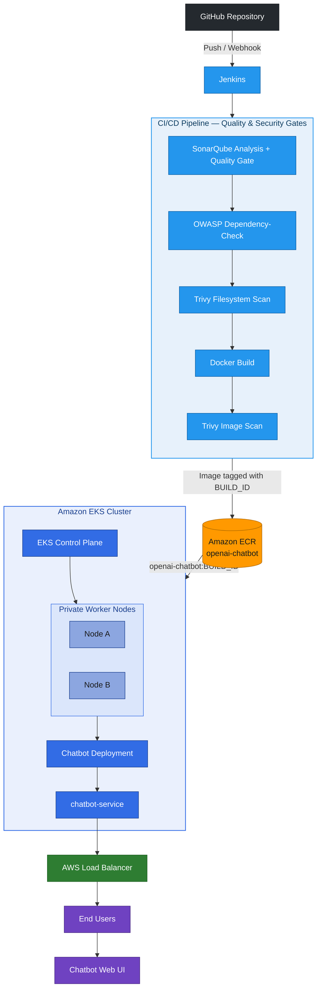

**Color key:** ⬛ Source control &nbsp;•&nbsp; 🟦 CI/CD pipeline stages &nbsp;•&nbsp; 🟧 Container registry (AWS) &nbsp;•&nbsp; 🔷 Kubernetes / EKS control plane &nbsp;•&nbsp; 🟢 Networking / external access &nbsp;•&nbsp; 🟣 End users

---

## Network Architecture

The EKS environment runs inside a **VPC spanning two Availability Zones** (`eu-north-1a`, `eu-north-1b`), following the standard AWS VPC module topology: one public and one private subnet per AZ, each with its own route table, and a dedicated NAT Gateway (with its own Elastic IP) per AZ for high-availability outbound access.

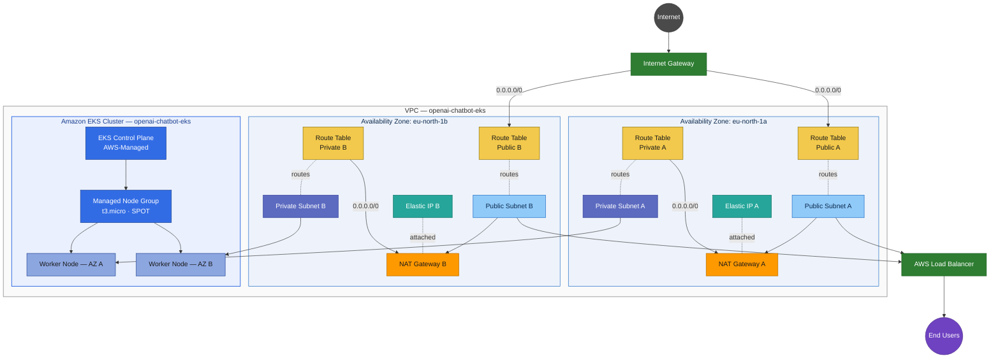

**Color key:** ⬛ Internet &nbsp;•&nbsp; 🟢 Internet Gateway / Load Balancer &nbsp;•&nbsp; 🟡 Route tables &nbsp;•&nbsp; 🔵 Public subnets &nbsp;•&nbsp; 🟣 Private subnets (indigo) &nbsp;•&nbsp; 🟧 NAT Gateways &nbsp;•&nbsp; 🟩 Elastic IPs (teal) &nbsp;•&nbsp; 🔷 EKS control plane / node group &nbsp;•&nbsp; 🟪 End users

### Network Resource Inventory

| Resource | Count | Notes |
|---|---|---|
| VPC | 1 | Spans both Availability Zones |
| Internet Gateway | 1 | Provides the VPC's path to the internet |
| Public Subnets | 2 | One per AZ (`eu-north-1a`, `eu-north-1b`) |
| Private Subnets | 2 | One per AZ — hosts the EKS worker nodes |
| Route Tables | 4 | One public + one private route table per AZ |
| NAT Gateways | 2 | One per AZ, for high-availability outbound access |
| Elastic IPs | 2 | One per NAT Gateway |
| EKS Cluster (Control Plane) | 1 | AWS-managed — `openai-chatbot-eks`, Kubernetes `1.35` |
| Managed Node Group | 1 | `t3.micro` / SPOT capacity, deployed across both private subnets |
| EKS Worker Nodes | 2 | One per AZ, running in private subnets |
| AWS Load Balancer | 1 | Provisioned by the `chatbot-service` `LoadBalancer` Service |

**Design reasoning:**

- **Worker nodes are placed in private subnets** so that Kubernetes compute does not require direct inbound internet exposure. This keeps the compute layer isolated from unsolicited inbound traffic.
- **Each AZ has its own route table pair** — a public route table pointing to the Internet Gateway, and a private route table pointing to that AZ's own NAT Gateway — so that a failure in one AZ's NAT path does not affect the other AZ.
- **Public subnets host internet-facing networking infrastructure** — the Internet Gateway path and NAT Gateways — while outbound access from the private nodes (for pulling images, calling AWS APIs, etc.) is routed through NAT Gateways rather than direct public IP assignment.
- **Two NAT Gateways, each with its own Elastic IP**, avoid a single NAT Gateway becoming a cross-AZ dependency for outbound traffic.
- **External access to the application** is handled entirely through a Kubernetes `LoadBalancer` Service provisioned in the public subnets, not through public IPs on the worker nodes themselves.

Kubernetes subnet tags are configured so AWS can correctly identify which subnets to use for load-balancer placement:

```text
kubernetes.io/role/elb = 1
kubernetes.io/role/internal-elb = 1
```

---

## Deployment Flow

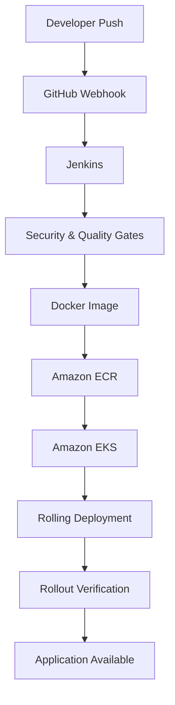

Every deployment is tagged with the **Jenkins build number**, which provides end-to-end traceability between the CI build, the ECR image, and the running Kubernetes workload:

```text
Jenkins Build #41
       ↓
ECR: openai-chatbot:41
       ↓
EKS: openai-chatbot:41
```

---

## Technology Stack

| Category | Technologies |
|---|---|
| Cloud Provider | AWS |
| Infrastructure as Code | Terraform |
| Containerization | Docker |
| Container Registry | Amazon ECR |
| Orchestration | Kubernetes / Amazon EKS |
| CI/CD | Jenkins |
| Source Control | Git / GitHub |
| Application | Next.js / Node.js |
| Code Quality | SonarQube |
| Dependency Security | OWASP Dependency-Check |
| Vulnerability Scanning | Trivy |
| Kubernetes Security | RBAC, Security Contexts, Probes |
| Networking | AWS VPC, Subnets, Internet Gateway, NAT Gateway |
| External Access | AWS Load Balancer |
| Deployment Strategy | Kubernetes Rolling Update |
| Recovery | Automated Kubernetes Rollback |

---

## AWS Infrastructure

The infrastructure is provisioned entirely through **Terraform**, avoiding manual creation of the core AWS resources.

### Region & Availability Zones

```text
Region: eu-north-1
Availability Zones: eu-north-1a, eu-north-1b
```

Using two Availability Zones provides a multi-AZ foundation for the EKS environment.

### VPC

```text
VPC
│
├── Public Subnets
│   ├── Internet Gateway connectivity
│   ├── NAT Gateway infrastructure
│   └── Internet-facing AWS resources
│
└── Private Subnets
    └── EKS Worker Nodes
```

### NAT Gateway

**Two NAT Gateways** are deployed, one per Availability Zone, so that private worker nodes can initiate outbound connections without ever needing to accept inbound connections directly from the public internet:

```text
Private Worker → NAT Gateway → Internet Gateway → Internet
```

### Amazon EKS

```text
Cluster:     openai-chatbot-eks
Kubernetes:  1.35
```

The cluster uses **EKS Managed Node Groups**. For this learning environment, worker nodes run on:

```text
Instance: t3.micro
Capacity: SPOT
```

> **Cost decision, not a production recommendation:** SPOT capacity and `t3.micro` instances were chosen deliberately to minimize cost in a learning/portfolio environment. For production workloads, appropriately sized instances and On-Demand (or a SPOT/On-Demand mix with interruption handling) would be preferred where workload reliability requires it.

**Worker node placement** keeps internet-facing infrastructure separate from internal Kubernetes compute — worker nodes run in private subnets, and the application is exposed externally through a Kubernetes `LoadBalancer` Service rather than public IPs on the nodes themselves.

### Kubernetes Workload

```text
Namespace: chatbot
Deployment: chatbot
Service: chatbot-service
Container Port: 3000
Service Port: 80
```

```yaml
type: LoadBalancer
```

This provisions an AWS load balancer for external access.

### Terraform Modules

```text
Terraform AWS VPC Module: v5.21.0
Terraform AWS EKS Module: v21.25.0
```

During implementation, the EKS module configuration had to be **updated to match the current module interface** rather than blindly reusing an older reference project's variables. This was validated through:

```bash
terraform validate
terraform plan
```

**Final resource counts:**

```text
VPC:                            23 resources
EKS:                            53 resources
EKS + Managed Node Group:       60 resources
```

---

## CI/CD & DevSecOps Pipeline

Jenkins automates the complete path from source-code change to Kubernetes deployment. The pipeline is intentionally structured so that **quality and security checks happen before the application is pushed to ECR or deployed to EKS** — a failed gate stops the pipeline before it can reach production.

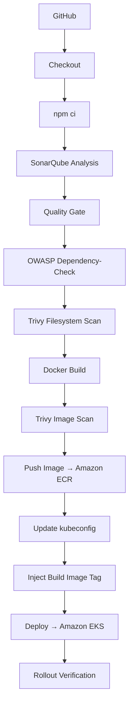

### 1. Checkout

Jenkins retrieves the latest source code from GitHub and works against the exact revision that triggered the build:

```groovy
checkout scm
```

### 2. Dependency Installation

```bash
npm ci
```

`npm ci` installs strictly from the lockfile rather than resolving ranges, which makes CI dependency installation **deterministic** — the same lockfile always produces the same `node_modules` tree, removing a class of "works on my machine" failures.

### 3. SonarQube Analysis & Quality Gate

SonarQube analyzes the application for code-quality and security-related issues. The pipeline then blocks on the configured Quality Gate:

```groovy
waitForQualityGate abortPipeline: true
```

Running this gate **before** the build stage means a code-quality regression is caught before any artifact is produced, not after it has already been pushed downstream.

### 4. OWASP Dependency-Check

OWASP Dependency-Check scans project dependencies for known vulnerabilities, excluding generated/vendor directories:

```text
node_modules/
.next/
```

An NVD API key is used to improve vulnerability-data retrieval speed and reliability.

### 5. Trivy Filesystem Scan

Trivy scans the application source tree for vulnerabilities, misconfigurations, and secrets, and the pipeline **fails the build** on HIGH/CRITICAL findings rather than merely reporting them:

```bash
trivy fs . \
  --scanners vuln,misconfig,secret \
  --exit-code 1 \
  --severity HIGH,CRITICAL
```

Running this scan on the filesystem — separately from the eventual container image scan — catches issues in source and dependencies before a Docker layer is even built.

### 6. Docker Build

Only after the quality and dependency-security stages pass does Jenkins build the container image:

```text
chatbot-ui:${BUILD_NUMBER}
```

The Dockerfile uses a multi-stage build:

```text
Dependencies → Build → Production Image
```

and the final runtime container runs as a **non-root user**.

### 7. Trivy Container Image Scan

The built image is scanned **separately** from the source filesystem scan, providing a second, independent security boundary around the actual artifact that will be deployed:

```bash
trivy image \
  --scanners vuln,misconfig,secret \
  --severity HIGH,CRITICAL \
  --exit-code 1 \
  chatbot-ui:${BUILD_NUMBER}
```

Filesystem scanning and image scanning are kept as distinct stages because they can surface different findings — a vulnerable base image layer, for example, may not be visible from a source-tree scan alone.

### 8. Push to Amazon ECR

The image is pushed to ECR **only after the image scan succeeds**:

```text
Amazon ECR → openai-chatbot
```

Images are tagged with the **Jenkins build number**, never `latest`:

```text
Jenkins Build #41 → openai-chatbot:41
```

Avoiding `latest` means every deployed artifact is unambiguously traceable back to the exact CI build that produced it — essential for both auditing and rollback.

### 9. Deploy to Amazon EKS

Jenkins authenticates against EKS and updates its Kubernetes configuration:

```bash
aws eks update-kubeconfig \
  --region eu-north-1 \
  --name openai-chatbot-eks
```

The Kubernetes manifest contains a placeholder:

```yaml
image: CHATBOT_IMAGE
```

which Jenkins replaces with the exact ECR image for the current build:

```text
CHATBOT_IMAGE → openai-chatbot:41
```

This keeps the Kubernetes manifest reusable across every build while letting CI control exactly which version gets deployed.

### 10. Rollout Verification

`kubectl apply` succeeding is **not** treated as proof of a successful deployment. Jenkins explicitly waits for the rollout to complete:

```bash
kubectl -n chatbot rollout status \
  deployment/chatbot \
  --timeout=120s
```

`kubectl rollout status` blocks until Kubernetes confirms the new ReplicaSet is actually healthy, catching failures — like a bad image — that `kubectl apply` alone would silently miss.

---

## DevSecOps Vulnerability Remediation

<div align="center">

### `36` → `15` → `2` → `0`

**HIGH/CRITICAL vulnerabilities identified and remediated**

</div>

The pipeline initially detected:

```text
36 vulnerabilities
├── 34 HIGH
└── 2 CRITICAL
```

Rather than suppressing the findings, the dependency tree was investigated to identify their **actual root causes**, and each was remediated individually:

| Issue | Remediation |
|---|---|
| Vulnerable `rehype-mathjax` | Replaced with `rehype-katex` |
| Unused `openai` dependency | Removed entirely |
| Outdated Next.js (`13.5.11`) | Upgraded to `15.5.25` |
| Nested vulnerable PostCSS | Resolved with an npm override |
| Stale dependency tree | Reinstalled dependencies and regenerated the lockfile |

After reinstalling dependencies and rescanning, the vulnerability count dropped in stages:

```text
36 → 15 → 2 → 0
```

**Final Trivy result: 0 HIGH/CRITICAL vulnerabilities.**

This reflects the intended DevSecOps workflow — findings are traced, not hidden:

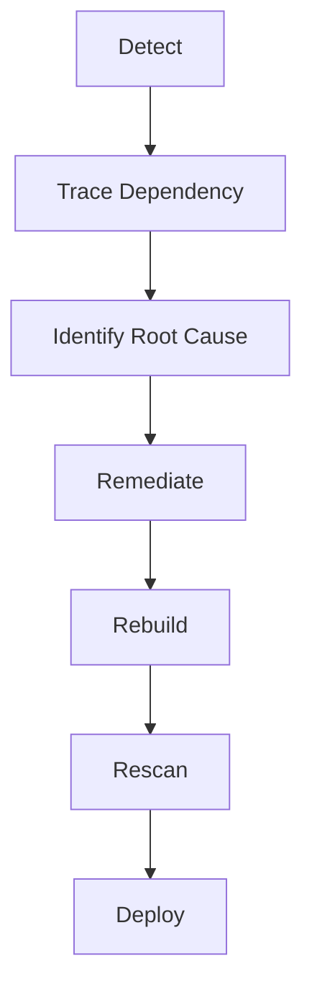

---

## DevSecOps Security Model

Security is not a separate activity performed after deployment — it is integrated directly into the delivery path, and a build that fails any configured quality or security gate does not proceed to the deployment stages:

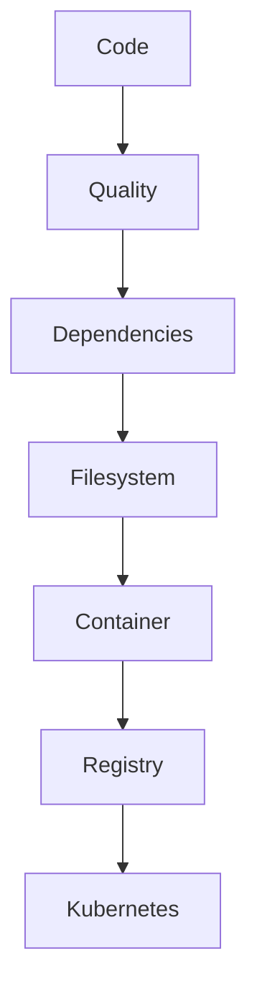

---

## Kubernetes Security & Workload Hardening

Security was applied at both the **container runtime** layer and the **CI/CD access** layer (CI/CD access is covered separately in [Jenkins → EKS Least-Privilege RBAC](#jenkins--eks-least-privilege-rbac)).

### Container Security Context

The chatbot container does not run with default privileges:

```yaml
securityContext:
  allowPrivilegeEscalation: false
  capabilities:
    drop:
      - ALL
  runAsNonRoot: true
  runAsUser: 10001
  runAsGroup: 10001
  readOnlyRootFilesystem: true
```

The Pod also enforces a restricted syscall profile:

```yaml
securityContext:
  seccompProfile:
    type: RuntimeDefault
```

| Control | Purpose |
|---|---|
| `runAsNonRoot` | Prevents the container from executing as root |
| Explicit UID/GID (`10001`) | Provides a predictable, non-root identity instead of an arbitrary one |
| `allowPrivilegeEscalation: false` | Prevents a process from gaining more privileges than its parent |
| Drop `ALL` capabilities | Removes Linux capabilities the application does not need |
| Read-only root filesystem | Reduces the container's ability to be modified at runtime |
| RuntimeDefault seccomp | Restricts access to potentially dangerous system calls |

---

## Kubernetes Health Checks

The application exposes a dedicated health endpoint:

```text
/api/health
```

Kubernetes uses this same endpoint for both readiness and liveness checks:

```yaml
readinessProbe:
  httpGet:
    path: /api/health
    port: 3000

livenessProbe:
  httpGet:
    path: /api/health
    port: 3000
```

This lets Kubernetes distinguish between two very different states:

```text
Pod exists  ≠  Application is ready
```

A Pod can be running while the application inside it is still starting up or has become unresponsive — the readiness probe controls whether it receives traffic, and the liveness probe controls whether Kubernetes restarts it. Resource **requests and limits** are also defined on the workload to prevent it from consuming unbounded cluster resources.

---

## Jenkins → EKS Least-Privilege RBAC

The initial implementation authenticated Jenkins against EKS using:

```text
AmazonEKSClusterAdminPolicy
```

at **cluster scope**. This worked, but it granted Jenkins far more access than the deployment process actually required — cluster-admin can modify or delete anything in the cluster, while the pipeline only ever needs to manage one application in one namespace. The configuration was redesigned around least privilege.

### Final Access Model

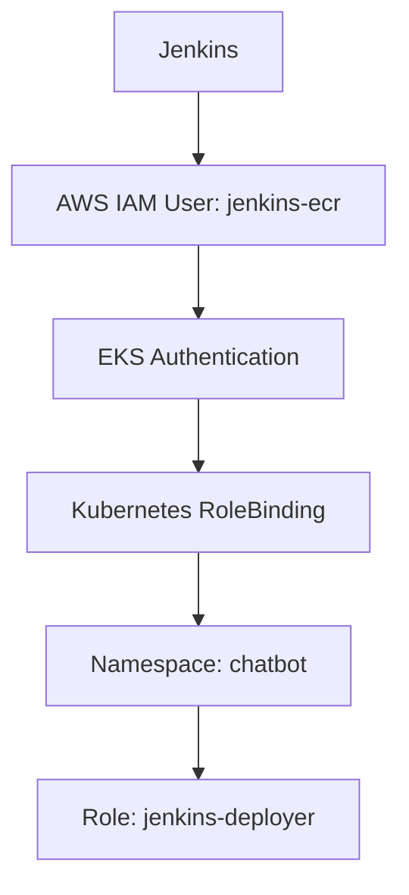

The cluster-admin policy was removed. The final Kubernetes `Role` is **namespace-scoped** and grants only the operations the pipeline actually performs.

**Deployment lifecycle permissions:**

```text
Resources: Deployments, ReplicaSets, Deployment status, Deployment scaling
Verbs:     get, list, watch, update, patch
```

**Read-only runtime access:**

```text
Resources: Services, Pods, Pod logs, Events
```

For example, Service access is intentionally read-only:

```text
services → get, list, watch
```

Jenkins does not receive Service **write** permissions — it inspects Services to verify state, but does not need to modify them.

### Why This Matters

The CI/CD system only needs to deploy and verify one application. It does not need **Cluster Administrator** permissions. The final model follows a simple rule:

```text
Required permission → Grant permission → Everything else → Deny by default
```

---

## Security Permission Iteration

The access model was **not** a one-shot configuration — it was tightened iteratively as the project matured, which demonstrates that a working deployment is not automatically a secure one.

| Stage | Access Model |
|---|---|
| **Initial** | Jenkins → Cluster Admin (`AmazonEKSClusterAdminPolicy`) |
| **Improved** | Jenkins → Namespace Role |
| **Further tightened** | Trivy identified excessive Kubernetes permissions, so Service access was reduced from write to read-only |
| **Final** | Jenkins → IAM Authentication → Namespace-scoped Role → Only required deployment + verification permissions |

> **A working deployment is not automatically a secure deployment.** The project deliberately evolved the Jenkins permissions from "works" to "works with the minimum required authority."

---

## Deployment Reliability & Automatic Rollback

The deployment pipeline does not assume that every new container image will start successfully. Kubernetes rollout health is explicitly verified, and deployment failures trigger an automated rollback.

### Deployment Verification

After applying the Kubernetes manifests, Jenkins waits for the deployment to complete:

```bash
kubectl -n chatbot rollout status \
  deployment/chatbot \
  --timeout=120s
```

A successful `kubectl apply` is **not** treated as proof that the new version is healthy — only a completed rollout is.

---

## Failure Simulation

To validate the recovery mechanism, a deliberately invalid image was deployed:

```text
openai-chatbot:does-not-exist
```

Kubernetes attempted to start the new ReplicaSet, but the image could not be pulled. The resulting Pod entered:

```text
ImagePullBackOff
```

and the rollout failed to complete within the configured timeout. This reproduced a **realistic** deployment failure — the recovery path was validated against an actual failure, not a theoretical one.

---

## Automatic Rollback

The Jenkins deployment stage wraps the deployment and rollout verification in error handling:

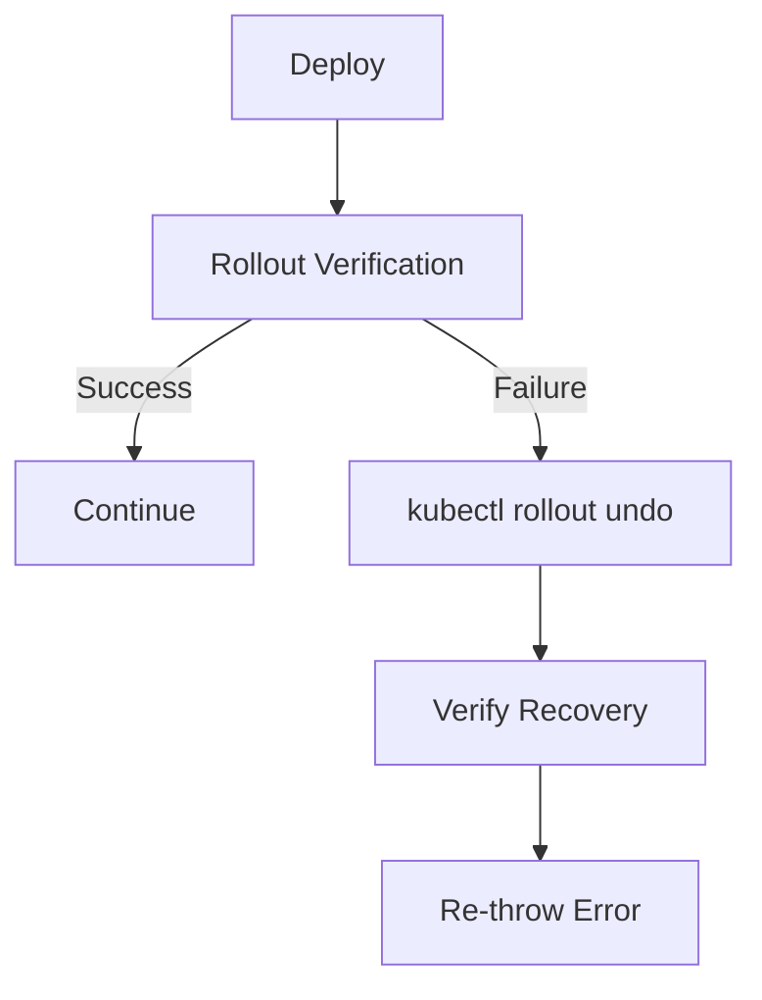

The rollback command restores the previous ReplicaSet:

```bash
kubectl -n chatbot rollout undo deployment/chatbot
```

Jenkins then waits for the recovered deployment to become healthy before proceeding.

### Why the Build Still Fails

The pipeline intentionally **re-throws the original exception** after recovery:

```groovy
catch (Exception e) {
    echo 'Deployment failed. Rolling back...'

    sh '''
        kubectl -n chatbot rollout undo deployment/chatbot
        kubectl -n chatbot rollout status deployment/chatbot --timeout=120s
    '''

    throw e
}
```

This creates an important distinction:

```text
Application Recovered  ≠  Deployment Successful
```

The application is restored to a healthy version, while Jenkins correctly reports the **deployment as failed**. This prevents a broken release from being falsely reported as successful, and keeps the CI history an accurate record of what actually shipped cleanly.

### Rollback Strategy

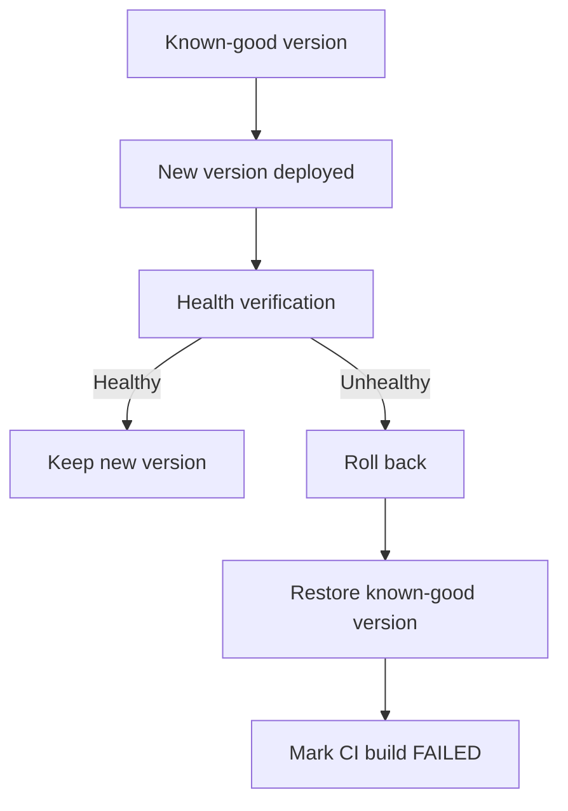

ECR lifecycle management complements this strategy by retaining the most recent tagged images, ensuring a previous, known-good artifact is always available for recovery.

---

## Reliability Controls

| Control | Purpose |
|---|---|
| Readiness probe | Prevents unhealthy Pods from receiving traffic |
| Liveness probe | Detects unhealthy application processes |
| Rollout status | Verifies deployment completion |
| Automatic rollback | Restores the previous workload version |
| Image versioning | Identifies the exact deployed build |
| ECR retention | Keeps recent images available for recovery |
| Resource limits | Prevents uncontrolled resource consumption |

The result is a deployment process designed to **detect failure, recover service, and still accurately report the failed release.**

---

## Troubleshooting & Real Engineering Problems

This project involved several real implementation issues rather than a completely linear deployment path. The debugging process consistently followed the same loop:

```text
Symptom → Investigate → Identify Root Cause → Apply Targeted Fix → Rebuild/Redeploy → Verify
```

<details>
<summary><strong>Terraform Module Compatibility</strong></summary>

**Problem:** The reference Terraform configuration used arguments that were incompatible with the current EKS module version.

**Investigation:** After upgrading the module, `terraform validate` and `terraform plan` exposed the incompatible configuration.

**Resolution:** Updated the configuration to the current module interface, including EKS cluster naming, Kubernetes version, and API endpoint settings.

**Result:** Terraform successfully progressed from VPC provisioning to EKS and managed node-group provisioning.

</details>

<details>
<summary><strong>Next.js Native Build Failure</strong></summary>

**Problem:** The Next.js production build encountered a low-level `Bus error`.

**Investigation:** The application itself was not the immediate cause — running the build with a single build worker succeeded.

**Resolution:**

```bash
NEXT_PRIVATE_BUILD_WORKER=1 npm run build
```

The same build configuration was then applied to the Docker build.

**Result:** The production image built successfully and proceeded through the security pipeline.

</details>

<details>
<summary><strong>Trivy Vulnerability Remediation</strong></summary>

**Problem:** The initial filesystem scan reported:

```text
36 vulnerabilities
34 HIGH
2 CRITICAL
```

**Investigation:** The dependency tree was traced to identify actual sources rather than suppressing the findings.

**Resolution:**
- Replaced `rehype-mathjax` with `rehype-katex`
- Removed the unused `openai` dependency
- Upgraded Next.js
- Updated the associated Next.js ESLint package
- Added an npm override for the vulnerable nested PostCSS version
- Reinstalled dependencies and regenerated the lockfile

**Result:**

```text
36 → 15 → 2 → 0
```

No real vulnerability was hidden using a blanket Trivy suppression.

</details>

<details>
<summary><strong>SonarQube Quality Gate Failure</strong></summary>

**Problem:** The initial Quality Gate failed because of reliability, coverage, and security-hotspot review conditions.

**Investigation:** Findings were separated into actual code-quality issues versus quality-policy requirements that were not appropriate for the current project scope.

**Resolution:**
- Fixed concrete code issues
- Removed unstable `Math.random()` React keys
- Removed unnecessary random filename generation
- Corrected regex-related findings
- Adjusted the Quality Gate to enforce meaningful project standards

**Result:** The pipeline successfully passed the SonarQube Quality Gate.

</details>

<details>
<summary><strong>Jenkins Kubernetes Permissions</strong></summary>

**Problem:** The initial Jenkins identity used cluster-admin-level EKS access.

**Investigation:** The deployment worked, but the permission scope was significantly broader than necessary.

**Resolution:**

```text
EKS Cluster Admin → Removed → Namespace-scoped Kubernetes Role
```

The Role was further tightened after identifying unnecessary Service write permissions.

**Result:** Jenkins continued to perform the required deployment and verification operations without cluster-admin access.

</details>

<details>
<summary><strong>Kubernetes Deployment Failure</strong></summary>

**Problem:** A deliberately invalid image caused `ImagePullBackOff`, and the rollout timed out.

**Resolution:** The deployment pipeline automatically executed `kubectl rollout undo` and verified that the previous version recovered successfully.

**Result:**

```text
Failed release → Automatic rollback → Healthy previous version → Jenkins build remains FAILED
```

This validated the failure-recovery path rather than testing only the happy path.

</details>

---

## Engineering Lessons

1. **Don't blindly copy infrastructure code** — verify module versions and interfaces.
2. **Trace vulnerabilities to their dependency root cause** before deciding how to handle them.
3. **Separate security findings from security policy** when designing quality gates.
4. **Least privilege is iterative** — start with a working model, then reduce permissions based on actual requirements.
5. **`kubectl apply` is not deployment verification** — wait for rollout health.
6. **Rollback should be automated and tested**, not merely documented.
7. **Build artifacts need traceable versions** — avoid relying on `latest`.
8. **Cost optimization is part of cloud engineering** — especially for non-production learning environments.

---

## Validation & Results

The final deployment was validated at multiple layers — from CI/CD execution and security scanning, to Kubernetes health, to actual HTTP traffic.

### Final Deployment State

| Metric | Result |
|---|---|
| Jenkins Build | **#41 SUCCESS** |
| Trivy HIGH/CRITICAL | **0** |
| EKS Worker Nodes | **2 Ready** |
| Deployment | **1/1 Ready** |
| Pod | **Running** |
| Pod Restarts | **0** |
| ECR Image | **`:41`** |
| HTTP Response | **200 OK** |

### End-to-End Validation

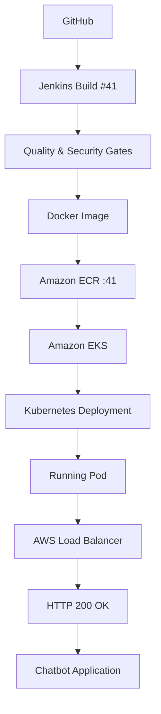

This confirms a complete, verified path from source commit to a live, externally reachable application.

### Kubernetes Validation

```bash
kubectl -n chatbot get deployment chatbot
kubectl -n chatbot get pods
kubectl -n chatbot get svc chatbot-service
```

**Deployment status:**

```text
READY       1/1
UP-TO-DATE  1
AVAILABLE   1
```

**Pod status:**

```text
READY      1/1
STATUS     Running
RESTARTS   0
```

**Deployed image:**

```text
574921529429.dkr.ecr.eu-north-1.amazonaws.com/openai-chatbot:41
```

### External Traffic Validation

The Kubernetes `LoadBalancer` Service exposed the application externally. HTTP validation returned:

```text
HTTP/1.1 200 OK
X-Powered-By: Next.js
```

This confirms that the application was not only deployed successfully at the Kubernetes-object level, but was also serving **real HTTP traffic** end-to-end.

---

## Project Evidence

The following categories of screenshots provide the strongest visual evidence for the implementation. *(Add image paths under `docs/evidence/` and reference them here as they become available — placeholders are used below so the structure can be populated later.)*

| # | Evidence | What It Proves |
|---|---|---|
| 1 | **Jenkins CI/CD Pipeline** — full pipeline run from checkout through EKS deployment | CI/CD automation, security gates, Docker build, ECR push, EKS deployment, rollout verification |
| 2 | **Trivy Security Scan** — final scan showing `0 vulnerabilities` | Vulnerability remediation, security scanning, pipeline security enforcement |
| 3 | **Amazon EKS Nodes** — worker nodes in `Ready` state | EKS cluster availability, managed worker nodes, Kubernetes runtime health |
| 4 | **Live Chatbot Application** — deployed application running | Application availability, successful deployment, functional runtime |
| 5 | **Least-Privilege RBAC** — Jenkins Kubernetes access model | Namespace-scoped CI/CD permissions, removal of unnecessary cluster-admin access |
| 6 | **Automatic Rollback** — deliberate deployment failure and recovery | Failure detection, rollout timeout, automatic rollback, recovery verification |

```text
docs/evidence/
├── 01-jenkins-pipeline.png        (placeholder)
├── 02-trivy-scan.png              (placeholder)
├── 03-eks-nodes.png               (placeholder)
├── 04-live-application.png        (placeholder)
├── 05-rbac.png                    (placeholder)
└── 06-rollback.png                (placeholder)
```

---

## Evidence Summary

| Area | Result |
|---|---|
| Infrastructure | Terraform-managed AWS/EKS environment |
| CI/CD | Jenkins automated deployment |
| Code Quality | SonarQube Quality Gate passed |
| Dependency Security | OWASP Dependency-Check integrated |
| Vulnerability Scanning | Trivy: 36 → 0 |
| Container Security | Hardened non-root workload |
| Kubernetes Access | Namespace-scoped least privilege |
| Deployment Verification | Rollout status enforced |
| Failure Recovery | Automated rollback tested |
| Image Management | Build-number traceability |
| ECR Cleanup | Lifecycle policy configured |
| Application | HTTP 200 / live chatbot |

---

## ECR Lifecycle & Cost Optimization

Amazon ECR is used as the private container registry for the chatbot images. Each Jenkins build produces a uniquely identifiable image:

```text
openai-chatbot:<BUILD_NUMBER>
```

For example:

```text
Jenkins Build #41 → ECR: openai-chatbot:41
```

### Image Retention Policy

Continuous CI/CD can quickly accumulate old and untagged image manifests. To control unnecessary registry storage, an ECR lifecycle policy was configured:

```text
Tagged images    → Keep latest 2
Untagged images  → Expire after 1 day
```

The policy is defined in `ecr/ecr-lifecycle-policy.json` and applied using the AWS CLI.

### Why Retain Two Tagged Images?

The latest image is the current release; the previous image provides a readily available rollback target:

```text
Current
   ├── openai-chatbot:41
   └── openai-chatbot:40  → Recovery option
```

Older tagged images can be removed without retaining an unlimited CI history in ECR.

### Cost-Conscious AWS Design

Because this is a learning and portfolio environment, infrastructure choices were intentionally balanced between realistic architecture and AWS cost:

- SPOT capacity for the EKS learning node group
- ECR lifecycle cleanup
- Avoiding unnecessary AWS services
- Using a small node instance size for the workload
- Destroying the environment when active experimentation is complete

> These choices are specific to the learning environment and should not automatically be applied to production workloads, where availability and capacity requirements differ.

---

## Project Outcomes

This project was built to demonstrate the practical responsibilities involved in **operating** a containerized application on AWS — not simply deploying one to Kubernetes.

**What was implemented:**

- Provisioned the AWS infrastructure using Terraform.
- Built an Amazon EKS cluster with managed worker nodes across multiple Availability Zones.
- Isolated EKS worker nodes in private subnets.
- Containerized the Next.js application using a multi-stage Docker build.
- Built a Jenkins CI/CD pipeline from source checkout through EKS deployment.
- Integrated SonarQube quality analysis and Quality Gates.
- Integrated OWASP Dependency-Check for dependency security.
- Integrated Trivy filesystem and container-image scanning.
- Remediated the application's initial 36 HIGH/CRITICAL vulnerabilities down to 0.
- Implemented Kubernetes workload hardening using security contexts.
- Replaced cluster-admin CI/CD access with namespace-scoped Kubernetes RBAC.
- Implemented build-number-based container image traceability.
- Added Kubernetes rollout verification.
- Tested a real deployment failure using an invalid image.
- Implemented and validated automated rollback.
- Configured ECR lifecycle management to control image accumulation.
- Validated the deployed application through an AWS LoadBalancer and HTTP request.

---

## Engineering Principles

| Principle | In Practice |
|---|---|
| **Infrastructure should be reproducible** | Terraform defines the infrastructure instead of relying on manually configured AWS resources |
| **Security should be integrated into delivery** | Security scanning occurs before the artifact reaches ECR and EKS |
| **Permissions should follow actual requirements** | Jenkins does not need cluster-admin access simply because it needs to deploy one application |
| **Deployment success must be verified** | A successful `kubectl apply` does not guarantee a healthy application — the pipeline waits for rollout completion |
| **Failures should be expected and recoverable** | The deployment process was deliberately broken, observed failing, and then recovered automatically through rollback |
| **Cost is part of cloud engineering** | The learning environment uses cost-conscious choices while clearly distinguishing them from production recommendations |

---

## Final Result

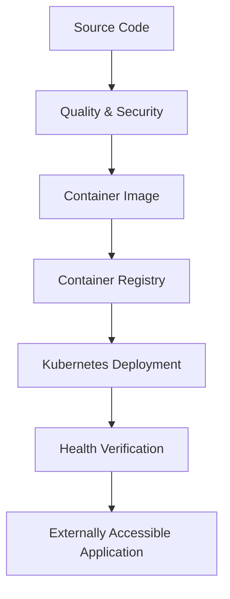

The completed system provides an automated path from source code to a live, externally accessible application — with **traceability, security controls, failure detection, and automated recovery** built directly into the delivery process.

---

## Repository Structure

The repository separates the application, Kubernetes configuration, CI/CD pipeline, container registry configuration, and AWS infrastructure.

```text
openai-chatbot-eks/
│
├── Chatbot-UI/
│   ├── k8s/
│   │   ├── deployment.yaml
│   │   ├── service.yaml
│   │   ├── jenkins-rbac.yaml
│   │   └── jenkins-rolebinding.yaml
│   │
│   ├── JenkinsFile/
│   │   └── Chatbot-Jenkinsfile
│   │
│   ├── ecr/
│   │   └── ecr-lifecycle-policy.json
│   │
│   ├── components/
│   │   ├── Chat/
│   │   ├── Chatbar/
│   │   ├── Folders/
│   │   ├── Global/
│   │   ├── Markdown/
│   │   ├── Mobile/
│   │   ├── Promptbar/
│   │   ├── Settings/
│   │   └── Sidebar/
│   │
│   ├── pages/
│   │   └── api/
│   │
│   ├── public/
│   │   └── locales/
│   │       ├── en/
│   │       ├── ar/
│   │       ├── de/
│   │       ├── es/
│   │       ├── fr/
│   │       └── ...
│   │
│   ├── utils/
│   │   ├── app/
│   │   └── server/
│   │
│   ├── types/
│   ├── styles/
│   ├── docs/
│   ├── reference/
│   ├── __tests__/
│   ├── Dockerfile
│   ├── package.json
│   └── package-lock.json
│
└── terraform/
    ├── main.tf
    ├── variables.tf
    ├── outputs.tf
    ├── providers.tf
    └── ...
```

### Directory Responsibilities

| Directory | Purpose |
|---|---|
| `Chatbot-UI/` | Next.js chatbot application |
| `components/` | Reusable React UI components |
| `pages/` | Next.js pages and API routes |
| `public/` | Static assets and localization files |
| `utils/` | Application and server-side utilities |
| `types/` | TypeScript types |
| `styles/` | Application styling |
| `__tests__/` | Application tests |
| `k8s/` | Kubernetes deployment, service, and RBAC manifests |
| `JenkinsFile/` | Jenkins CI/CD pipeline |
| `ecr/` | ECR lifecycle policy |
| `terraform/` | AWS infrastructure as code |

> Generated directories such as `.next/`, `.terraform/`, and Terraform provider/module caches are intentionally excluded from the documented repository structure.

---

## Deployment Instructions

### Prerequisites

```text
AWS CLI
Terraform
kubectl
Docker
Git
Jenkins
```

AWS credentials must have the permissions required for the infrastructure and deployment operations being performed.

### Provision Infrastructure

```bash
cd terraform

terraform init
terraform validate
terraform plan
terraform apply
```

Configure `kubectl` to access the EKS cluster:

```bash
aws eks update-kubeconfig \
  --region eu-north-1 \
  --name openai-chatbot-eks
```

### Build & Deploy

Application deployments are handled through Jenkins. A source-code push triggers the configured GitHub webhook, after which Jenkins executes the CI/CD pipeline:

```text
GitHub
   ↓
Jenkins
   ↓
Quality & Security Gates
   ↓
Docker Build
   ↓
Trivy Image Scan
   ↓
Amazon ECR
   ↓
Amazon EKS
   ↓
Rollout Verification
```

Each successful build receives a unique image tag based on the Jenkins build number.

---

## Verification Instructions

```bash
kubectl get nodes

kubectl -n chatbot get deployment chatbot

kubectl -n chatbot get pods

kubectl -n chatbot get service chatbot-service

kubectl -n chatbot rollout status deployment/chatbot
```

Verify the exact deployed image:

```bash
kubectl -n chatbot get deployment chatbot \
  -o jsonpath='{.spec.template.spec.containers[0].image}{"\n"}'
```

---

## Cleanup

This project provisions AWS resources that can incur charges, particularly **EKS, NAT Gateways, load-balancing infrastructure, and related networking resources**.

When the learning environment is no longer required:

```bash
cd terraform

terraform destroy
```

After destruction, verify the AWS account for any resources that were created **outside** Terraform, such as manually configured ECR resources or other supporting services.

> **Cost warning:** Avoid leaving the EKS environment running when it is not being actively used for learning or testing.
